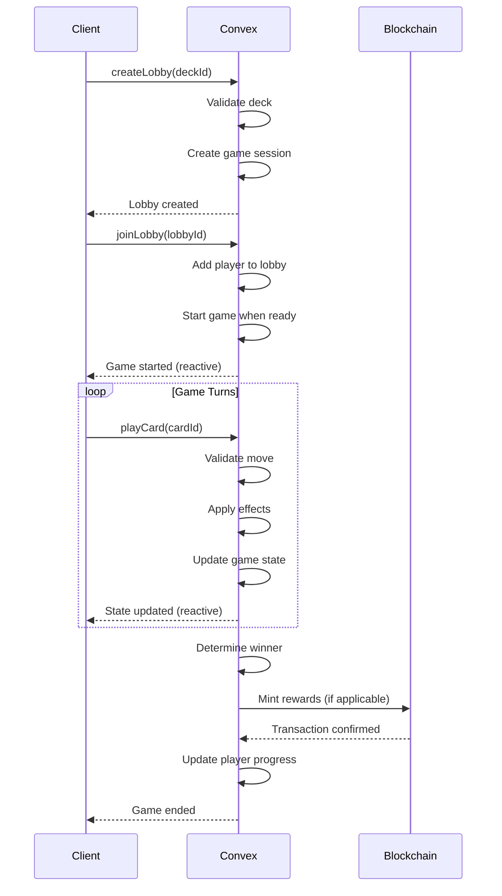
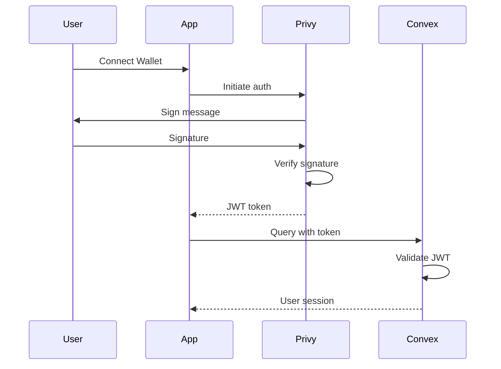
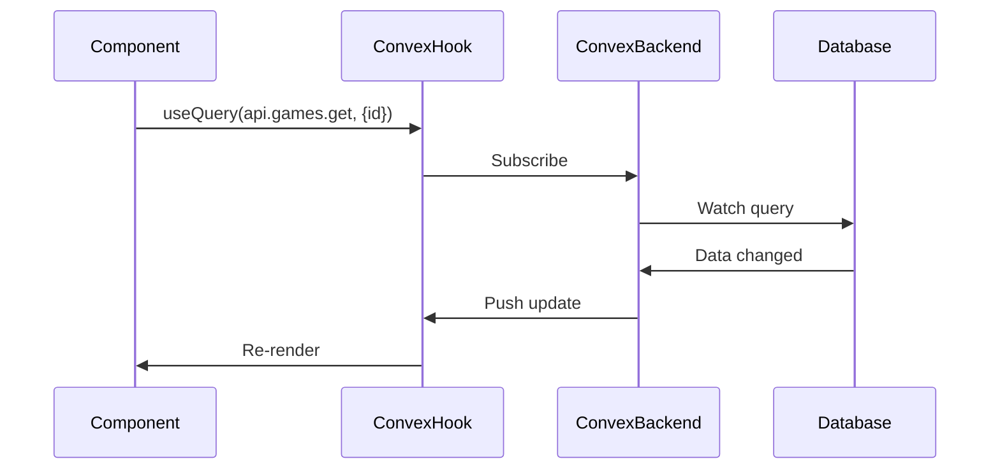

# LTCG Architecture

This document provides a comprehensive overview of the LTCG (Lunch Table Card Game) system architecture, design decisions, and data flows.

## Table of Contents

- [System Overview](#system-overview)
- [Technology Stack](#technology-stack)
- [Architecture Layers](#architecture-layers)
- [Data Flow](#data-flow)
- [Security](#security)
- [Scalability](#scalability)

## System Overview

LTCG is a full-stack trading card game built as a Bun monorepo with the following characteristics:

- **Frontend**: Next.js 15 (App Router) with React 19
- **Backend**: Convex (serverless reactive database)
- **Authentication**: Privy (wallet-first auth)
- **Deployment**: Vercel (edge functions)
- **Blockchain**: Solana integration for on-chain assets
- **Monorepo**: Turborepo with Bun package manager

### Key Features

- Real-time multiplayer card battles
- Blockchain-based asset ownership
- AI-powered NPC opponents (ElizaOS)
- Story mode progression
- Economy and marketplace
- Battle pass system
- Admin dashboard

## Technology Stack

### Frontend

```
Next.js 15.5.7
├── React 19.2
├── TypeScript 5.8
├── Tailwind CSS 4
├── Framer Motion (animations)
├── Radix UI (primitives)
└── Convex React (data sync)
```

### Backend

```
Convex 1.31.6
├── TypeScript
├── Zod (validation)
├── Convex Helpers
└── Custom middleware
```

### DevOps

```
Bun 1.3.5
├── Turbo 2.7.5
├── Biome 1.9.4 (linting/formatting)
├── Vitest 4.0.18 (unit tests)
├── Playwright 1.57 (E2E tests)
└── GitHub Actions (CI/CD)
```

## Architecture Layers

### 1. Presentation Layer (Frontend)

**Apps:**
- `apps/web` - Main player application
- `apps/admin` - Administrative dashboard
- `apps/docs` - Documentation site (Fumadocs)

**Responsibilities:**
- User interface rendering
- Client-side routing (Next.js App Router)
- Real-time data subscription (Convex React hooks)
- Wallet connection (Privy + Solana Web3.js)
- State management (Zustand for local state)
- Animation and UX (Framer Motion)

**Architecture Pattern:**
- Server Components for static content
- Client Components for interactive UI
- API Routes for webhooks and middleware
- Edge Middleware for auth/routing

### 2. Application Layer (Backend)

**Location:** `convex/`

**Modules:**
```
convex/
├── admin/          # Admin operations (RBAC)
├── core/           # Core game logic (cards, decks)
├── gameplay/       # Game engine, effects, phases
├── progression/    # XP, levels, achievements
├── economy/        # Currency, shop, marketplace
├── social/         # Chat, friends, tournaments
├── wallet/         # Blockchain integration
├── treasury/       # Token launch management
└── http/           # HTTP endpoints and webhooks
```

**Responsibilities:**
- Business logic execution
- Data validation (Zod schemas)
- Access control (RBAC with role checks)
- Real-time data synchronization
- Background jobs (cron tasks)
- Webhook handling

**Architecture Pattern:**
- Query functions (read operations)
- Mutation functions (write operations)
- Action functions (external API calls)
- Internal functions (system operations)
- Scheduled functions (cron jobs)

### 3. Data Layer

**Database:** Convex (document-based, reactive)

**Schema Organization:**
```
Tables:
├── users            # Player accounts
├── cards            # Card definitions
├── decks            # Player decks
├── games            # Active game sessions
├── gameEvents       # Game state changes
├── playerProgress   # XP, levels
├── achievements     # Unlocked achievements
├── inventory        # Player-owned items
├── marketplace      # Trading listings
├── wallets          # Blockchain wallet links
└── adminRoles       # RBAC configuration
```

**Indexes:**
- Query optimization (user lookups, game joins)
- Unique constraints (username, wallet address)
- Compound indexes (game + player queries)

**Relationships:**
- User → Decks (1:many)
- User → Progress (1:1)
- Game → Players (1:many)
- Card → Inventory (many:many)

### 4. Shared Layer

**Location:** `packages/core/`

**Contents:**
```
@ltcg/core/
├── types/          # TypeScript types, Convex wrappers
├── utils/          # Pure utility functions
├── validators/     # Zod schemas
└── config/         # Shared configurations
    ├── tsconfig/   # TypeScript base configs
    ├── tailwind/   # Tailwind presets
    ├── postcss/    # PostCSS configs
    └── vitest/     # Test configs
```

**Purpose:**
- Code reuse across apps and packages
- Type safety guarantees
- Configuration consistency
- Zero-runtime overhead (TypeScript only)

## Data Flow

### Game Initialization Flow



### Authentication Flow



### Real-Time Subscription Flow



## Security

### Authentication & Authorization

1. **Wallet-First Auth (Privy)**
   - Sign-in with Ethereum/Solana wallet
   - Social login as fallback (Google, Twitter)
   - JWT tokens for session management
   - Embedded wallets for Web2 users

2. **Role-Based Access Control (RBAC)**
   ```typescript
   Roles:
   ├── SUPER_ADMIN (full access)
   ├── ADMIN (content management)
   ├── MODERATOR (user moderation)
   └── PLAYER (default permissions)
   ```

3. **Function-Level Security**
   ```typescript
   // Convex mutation with auth check
   export const updateCard = mutation({
     args: { cardId: v.id("cards"), ... },
     handler: async (ctx, args) => {
       // Check authentication
       const user = await ctx.auth.getUserIdentity();
       if (!user) throw new Error("Unauthorized");
       
       // Check authorization
       const hasPermission = await isAdmin(ctx);
       if (!hasPermission) throw new Error("Forbidden");
       
       // Execute operation
       await ctx.db.patch(args.cardId, { ... });
     },
   });
   ```

### Data Validation

- **Input Validation**: Zod schemas on all mutations
- **Output Validation**: Return type validators
- **SQL Injection**: Not applicable (document database)
- **XSS Protection**: React automatic escaping + DOMPurify
- **CSRF Protection**: Convex handles token validation

### Secrets Management

- Environment variables via `.env.local`
- Encrypted secrets in Vercel (production)
- No secrets in client-side code
- Separate configs per environment

## Scalability

### Horizontal Scaling

**Convex Backend:**
- Auto-scales with load
- No server management required
- Global CDN for edge caching
- Optimistic UI updates

**Next.js Frontend:**
- Deployed on Vercel Edge Network
- Automatic static optimization
- Image optimization (next/image)
- Code splitting per route

### Performance Optimizations

1. **Caching Strategy**
   ```
   - Static pages: CDN cached
   - Dynamic pages: ISR (Incremental Static Regeneration)
   - API routes: Stale-while-revalidate
   - Database queries: Convex automatic caching
   ```

2. **Bundle Optimization**
   ```
   - Tree shaking (Bun + Next.js)
   - Code splitting (route-based)
   - Lazy loading (React.lazy)
   - Image optimization (WebP, AVIF)
   ```

3. **Database Optimization**
   ```
   - Indexed queries
   - Pagination (cursor-based)
   - Selective field projection
   - Batch operations
   ```

### Monitoring & Observability

- **Error Tracking**: (To be added - Sentry recommended)
- **Performance Monitoring**: (To be added - Vercel Analytics)
- **Logging**: Console logs (production: structured JSON)
- **Uptime Monitoring**: (To be added)

## Future Architecture Considerations

### Planned Enhancements

1. **Microservices**
   - Separate game engine service
   - AI opponent service (ElizaOS plugin)
   - Matchmaking service

2. **Event Sourcing**
   - Game replay system
   - Audit trail for sensitive operations
   - Time-travel debugging

3. **GraphQL Gateway**
   - Unified API for multiple clients
   - Mobile app support
   - Third-party integrations

4. **CDN for Assets**
   - Card images on CDN (Cloudflare, Vercel Blob)
   - Audio files for game effects
   - Video replays

### Scalability Limits

Current architecture can handle:
- **Concurrent users**: ~10,000 (Convex free tier)
- **Database size**: ~1GB (Convex free tier)
- **API calls**: ~1M/month (Convex free tier)

For growth beyond these limits:
- Upgrade to Convex Pro
- Implement caching layers (Redis)
- Consider database sharding
- Optimize hot paths

---

Last updated: February 2026
