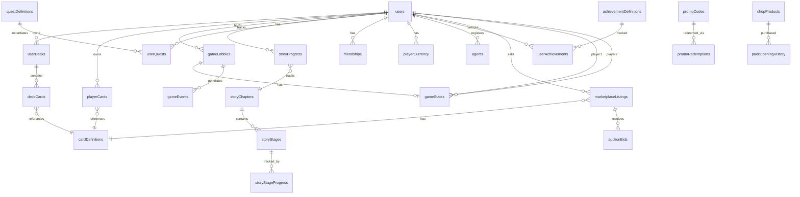

# Database Schema Documentation

## Overview

The LTCG (Lunch Table Card Game) backend uses Convex as its real-time database. The schema consists of 40+ tables organized into logical modules:

- **Authentication & Users**: User accounts, preferences, admin roles
- **Game System**: Lobbies, game states, events, matchmaking
- **Card System**: Card definitions, player collections, decks
- **Economy**: Currency, shop, marketplace, promo codes
- **Progression**: Story mode, quests, achievements, XP
- **Social**: Friends, chat, leaderboards, presence

## Entity Relationship Diagram



## Core Tables

### users

**Purpose**: Central user table with authentication, stats, and economy data.

**Indexes**:
- `email`: Look up users by email (authentication)
- `username`: Look up users by username (profiles, social)
- `rankedElo`: Leaderboard ranking for ranked mode
- `casualRating`: Leaderboard ranking for casual mode
- `totalWins`: Win count leaderboard
- `xp`: XP/level leaderboard
- `rankedElo_byType`: Segmented leaderboard (humans vs AI)
- `casualRating_byType`: Segmented leaderboard (humans vs AI)
- `xp_byType`: Segmented XP leaderboard

**Key Fields**:
| Field | Type | Default | Description |
|-------|------|---------|-------------|
| email | string? | - | User email (optional for anonymous) |
| username | string? | - | Display username |
| activeDeckId | Id<userDecks>? | - | Currently selected deck |
| rankedElo | number | 1000 | Ranked mode rating |
| casualRating | number | 1000 | Casual mode rating |
| totalWins | number | 0 | All-time wins |
| totalLosses | number | 0 | All-time losses |
| currentWinStreak | number | 0 | Active win streak |
| longestWinStreak | number | 0 | Best win streak |
| xp | number | 0 | Experience points |
| level | number | 1 | Player level |
| gold | number | 500 | In-game currency |
| isAiAgent | boolean | false | Is this an AI bot |

**Relationships**:
- Has many `userDecks` (user-created decks)
- Has many `playerCards` (card collection)
- Has one `playerCurrency` (economy tracking)
- Has one `playerXP` (progression tracking)

**Example Query**:
```typescript
// Get top 10 ranked players
const topPlayers = await ctx.db
  .query("users")
  .withIndex("rankedElo")
  .order("desc")
  .take(10);
```

---

### adminRoles

**Purpose**: Track admin and moderator permissions for protected operations.

**Indexes**:
- `by_user`: Look up roles by userId
- `by_role`: Find all admins/moderators

**Key Fields**:
| Field | Type | Description |
|-------|------|-------------|
| userId | Id<users> | User with admin access |
| role | "admin" \| "moderator" | Permission level |
| grantedBy | Id<users>? | Who granted this role |
| grantedAt | number | Timestamp of grant |
| isActive | boolean | Can be revoked |

---

### userPreferences

**Purpose**: Store user settings for UI, sound, privacy, etc.

**Indexes**:
- `by_user`: Look up preferences by userId

**Key Fields**:
| Field | Type | Description |
|-------|------|-------------|
| userId | Id<users> | Preferences owner |
| notifications | object | Quest, match, friend request settings |
| display | object | Animation, motion, card quality |
| game | object | Sound, music, auto-end turn |
| privacy | object | Profile visibility, online status |

**Example Query**:
```typescript
// Get user preferences
const prefs = await ctx.db
  .query("userPreferences")
  .withIndex("by_user", (q) => q.eq("userId", userId))
  .first();
```

---

## Agent System

### agents

**Purpose**: AI agents registered by users to play games programmatically.

**Indexes**:
- `by_user`: Find all agents owned by a user
- `by_name`: Look up agents by name

**Key Fields**:
| Field | Type | Description |
|-------|------|-------------|
| userId | Id<users> | Owner of the agent |
| name | string | Agent display name |
| starterDeckCode | string | Deck code for agent |
| stats | object | gamesPlayed, gamesWon, totalScore |
| isActive | boolean | Can be deactivated |

---

### apiKeys

**Purpose**: Hashed API keys for agent authentication.

**Indexes**:
- `by_key_hash`: Authentication lookup
- `by_agent`: Find keys for an agent
- `by_user`: Find all keys for a user

**Key Fields**:
| Field | Type | Description |
|-------|------|-------------|
| agentId | Id<agents> | Agent this key belongs to |
| userId | Id<users> | Owner of the agent |
| keyHash | string | SHA-256 hash of API key |
| keyPrefix | string | First 8 chars (for display) |
| lastUsedAt | number? | Last API call timestamp |
| isActive | boolean | Can be revoked |

---

## Game System

### gameLobbies

**Purpose**: Game matchmaking and lobby management. Tracks waiting, active, and completed games.

**Indexes**:
- `by_status`: Filter by lobby state
- `by_mode_status`: Mode-specific lobbies (ranked/casual)
- `by_host`: Find games hosted by user
- `by_join_code`: Private match lookup
- `by_last_move`: Detect inactive games

**Key Fields**:
| Field | Type | Description |
|-------|------|-------------|
| hostId | Id<users> | Player who created lobby |
| hostUsername | string | Denormalized for display |
| mode | string | "casual" \| "ranked" |
| status | string | "waiting" \| "active" \| "completed" |
| isPrivate | boolean | Private match with join code |
| joinCode | string? | 6-character code |
| opponentId | Id<users>? | Matched opponent |
| gameId | string? | Unique game identifier |
| turnNumber | number? | Current turn |
| currentTurnPlayerId | Id<users>? | Whose turn |
| turnStartedAt | number? | Turn timer tracking |
| winnerId | Id<users>? | Winner of game |
| spectatorCount | number | 0 | Number of spectators |
| allowSpectators | boolean | true | Spectator toggle |

**Example Query**:
```typescript
// Find available casual lobbies
const lobbies = await ctx.db
  .query("gameLobbies")
  .withIndex("by_mode_status", (q) =>
    q.eq("mode", "casual").eq("status", "waiting")
  )
  .collect();
```

---

### gameStates

**Purpose**: Complete game state for gameplay, reconnection, and spectating.

**Indexes**:
- `by_lobby`: Find state by lobby ID
- `by_game_id`: Find state by game ID
- `by_host`: Find games by player
- `by_opponent`: Find games by player
- `by_game_mode`: Filter PVP vs Story

**Key Fields** (abbreviated):
| Field | Type | Description |
|-------|------|-------------|
| lobbyId | Id<gameLobbies> | Associated lobby |
| gameId | string | Unique game ID |
| hostId | Id<users> | Player 1 |
| opponentId | Id<users> | Player 2 |
| hostHand | Id<cardDefinitions>[] | Cards in hand |
| hostBoard | BoardCard[] | Monsters on field |
| hostSpellTrapZone | SpellTrapCard[] | S/T cards |
| hostFieldSpell | FieldSpell? | Field spell |
| hostDeck | Id<cardDefinitions>[] | Remaining deck |
| hostGraveyard | Id<cardDefinitions>[] | Graveyard |
| hostBanished | Id<cardDefinitions>[] | Banished zone |
| hostLifePoints | number | LP (default 8000) |
| currentPhase | Phase | Yu-Gi-Oh phases |
| currentChain | ChainLink[]? | Active chain |
| pendingAction | PendingAction? | Attack/summon pending |
| temporaryModifiers | Modifier[]? | Until end of turn |
| gameMode | "pvp" \| "story" | Game type |
| isAIOpponent | boolean | AI opponent |
| aiDifficulty | Difficulty? | AI strength |

**Board Card Structure**:
```typescript
{
  cardId: Id<"cardDefinitions">,
  position: number, // 1 = attack, -1 = defense
  attack: number,
  defense: number,
  hasAttacked: boolean,
  isFaceDown: boolean,
  cannotBeDestroyedByBattle?: boolean,
  cannotBeDestroyedByEffects?: boolean,
  cannotBeTargeted?: boolean,
}
```

**Chain Link Structure**:
```typescript
{
  cardId: Id<"cardDefinitions">,
  playerId: Id<"users">,
  spellSpeed: number, // 1, 2, or 3
  effect: string,
  targets?: Id<"cardDefinitions">[],
  negated?: boolean,
}
```

**Example Query**:
```typescript
// Get game state for reconnection
const state = await ctx.db
  .query("gameStates")
  .withIndex("by_lobby", (q) => q.eq("lobbyId", lobbyId))
  .first();
```

---

### gameEvents

**Purpose**: Event log for spectators, replays, and analytics.

**Indexes**:
- `by_lobby`: Get all events for a lobby
- `by_game`: Get all events for a game ID
- `by_timestamp`: Chronological order

**Event Types** (35 total):
- **Lifecycle**: game_start, game_end, turn_start, turn_end, phase_changed
- **Summons**: normal_summon, tribute_summon, flip_summon, special_summon, summon_negated
- **Placements**: monster_set, spell_set, trap_set
- **Activations**: spell_activated, trap_activated, effect_activated, activation_negated
- **Chain**: chain_link_added, chain_resolving, chain_resolved
- **Combat**: battle_phase_entered, attack_declared, damage_calculated, damage, card_destroyed_battle
- **Zones**: card_drawn, card_to_hand, card_to_graveyard, card_banished, card_to_deck, position_changed
- **Resources**: lp_changed, tribute_paid, deck_shuffled, hand_limit_enforced

**Key Fields**:
| Field | Type | Description |
|-------|------|-------------|
| lobbyId | Id<gameLobbies> | Associated lobby |
| gameId | string | Game identifier |
| turnNumber | number | Turn this occurred |
| eventType | EventType | Type of event |
| playerId | Id<users> | Who caused event |
| description | string | Human-readable text |
| metadata | any? | Event-specific data |
| timestamp | number | Event time |

**Example Query**:
```typescript
// Get recent events for spectators
const events = await ctx.db
  .query("gameEvents")
  .withIndex("by_lobby", (q) => q.eq("lobbyId", lobbyId))
  .order("desc")
  .take(50);
```

---

### matchmakingQueue

**Purpose**: Quick match queue for automatic matchmaking.

**Indexes**:
- `by_rating`: Match similar skill players
- `by_user`: Check if user in queue
- `by_mode_rating`: Mode-specific matchmaking

**Key Fields**:
| Field | Type | Description |
|-------|------|-------------|
| userId | Id<users> | Queued player |
| username | string | Display name |
| rating | number | ELO for matching |
| deckArchetype | string | Deck type |
| mode | string | "ranked" \| "casual" |
| joinedAt | number | Queue timestamp |

---

## Card System

### cardDefinitions

**Purpose**: Master card database - all cards available in the game.

**Indexes**:
- `by_rarity`: Filter by rarity
- `by_archetype`: Filter by archetype
- `by_type`: Filter by card type
- `by_name`: Search by name

**Key Fields**:
| Field | Type | Description |
|-------|------|-------------|
| name | string | Card name |
| rarity | Rarity | common, uncommon, rare, epic, legendary |
| archetype | Archetype | infernal_dragons, abyssal_horrors, etc. |
| cardType | CardType | creature, spell, trap, equipment |
| attack | number? | Attack value (creatures) |
| defense | number? | Defense value (creatures) |
| cost | number | Mana/cost to play |
| ability | string? | Effect description |
| flavorText | string? | Lore text |
| imageUrl | string? | Image URL |
| imageStorageId | Id<_storage>? | Convex storage ID |
| isActive | boolean | Available in game |

**Example Query**:
```typescript
// Get all legendary cards
const legendaryCards = await ctx.db
  .query("cardDefinitions")
  .withIndex("by_rarity", (q) => q.eq("rarity", "legendary"))
  .collect();
```

---

### playerCards

**Purpose**: Player card collections with quantities.

**Indexes**:
- `by_user`: Get all cards for a user
- `by_user_card`: Check ownership of specific card
- `by_user_favorite`: Get favorited cards

**Key Fields**:
| Field | Type | Description |
|-------|------|-------------|
| userId | Id<users> | Card owner |
| cardDefinitionId | Id<cardDefinitions> | Card reference |
| quantity | number | How many owned |
| isFavorite | boolean | Favorited for quick access |
| acquiredAt | number | First acquired timestamp |

**Example Query**:
```typescript
// Check if user owns enough copies
const owned = await ctx.db
  .query("playerCards")
  .withIndex("by_user_card", (q) =>
    q.eq("userId", userId).eq("cardDefinitionId", cardId)
  )
  .first();
```

---

### userDecks

**Purpose**: User-created deck builds.

**Indexes**:
- `by_user`: Get all decks for a user
- `by_user_active`: Get active (non-deleted) decks
- `by_updated`: Sort by last modified

**Key Fields**:
| Field | Type | Description |
|-------|------|-------------|
| userId | Id<users> | Deck owner |
| name | string | Deck name |
| description | string? | Deck description |
| deckArchetype | Archetype? | Primary archetype |
| isActive | boolean | Soft delete flag |
| createdAt | number | Creation timestamp |
| updatedAt | number | Last modified |

---

### deckCards

**Purpose**: Cards within each user deck (join table).

**Indexes**:
- `by_deck`: Get all cards in a deck
- `by_deck_card`: Check if card in deck

**Key Fields**:
| Field | Type | Description |
|-------|------|-------------|
| deckId | Id<userDecks> | Parent deck |
| cardDefinitionId | Id<cardDefinitions> | Card reference |
| quantity | number | 1-3 copies per card |
| position | number? | Card ordering |

**Example Query**:
```typescript
// Get full deck composition
const cards = await ctx.db
  .query("deckCards")
  .withIndex("by_deck", (q) => q.eq("deckId", deckId))
  .collect();
```

---

## Economy System

### playerCurrency

**Purpose**: Track player currency balances and lifetime stats.

**Indexes**:
- `by_user`: Look up currency by user

**Key Fields**:
| Field | Type | Description |
|-------|------|-------------|
| userId | Id<users> | Currency owner |
| gold | number | Gold balance |
| gems | number | Gem balance |
| lifetimeGoldEarned | number | Total earned |
| lifetimeGoldSpent | number | Total spent |
| lifetimeGemsEarned | number | Total earned |
| lifetimeGemsSpent | number | Total spent |

---

### currencyTransactions

**Purpose**: Audit trail for all currency transactions.

**Indexes**:
- `by_user_time`: User transaction history
- `by_type`: Filter by transaction type
- `by_reference`: Look up by reference ID

**Transaction Types**:
- purchase, reward, sale, gift, refund, conversion
- marketplace_fee, auction_bid, auction_refund

**Key Fields**:
| Field | Type | Description |
|-------|------|-------------|
| userId | Id<users> | Transaction owner |
| transactionType | TransactionType | Type of transaction |
| currencyType | "gold" \| "gems" | Currency type |
| amount | number | Amount (positive/negative) |
| balanceAfter | number | Balance after transaction |
| referenceId | string? | External reference |
| description | string | Human-readable |
| metadata | any? | Extra data |

---

### shopProducts

**Purpose**: Shop product catalog (packs, boxes, currency).

**Indexes**:
- `by_type`: Filter by product type
- `by_active`: Get available products
- `by_product_id`: Look up by product ID

**Product Types**:
- **pack**: Card pack with rarity guarantees
- **box**: Bundle of packs
- **currency**: Gold/gem purchases

**Key Fields**:
| Field | Type | Description |
|-------|------|-------------|
| productId | string | Unique identifier |
| name | string | Product name |
| description | string | Product description |
| productType | ProductType | pack, box, currency |
| goldPrice | number? | Gold cost |
| gemPrice | number? | Gem cost |
| packConfig | PackConfig? | Pack configuration |
| boxConfig | BoxConfig? | Box configuration |
| currencyConfig | CurrencyConfig? | Currency config |
| isActive | boolean | Available for purchase |
| sortOrder | number | Display order |

**Example Query**:
```typescript
// Get all active packs
const packs = await ctx.db
  .query("shopProducts")
  .withIndex("by_type", (q) =>
    q.eq("productType", "pack").eq("isActive", true)
  )
  .collect();
```

---

### packOpeningHistory

**Purpose**: Track pack purchases and pulls for analytics.

**Indexes**:
- `by_user_time`: User purchase history
- `by_time`: Global purchase analytics

**Key Fields**:
| Field | Type | Description |
|-------|------|-------------|
| userId | Id<users> | Purchaser |
| productId | string | Product purchased |
| packType | string | Pack type name |
| cardsReceived | CardPull[] | Cards pulled |
| currencyUsed | "gold" \| "gems" | Payment method |
| amountPaid | number | Cost |
| openedAt | number | Timestamp |

---

### marketplaceListings

**Purpose**: Player-to-player card trading marketplace.

**Indexes**:
- `by_status`: Active/sold/cancelled listings
- `by_seller`: Seller's listings
- `by_card`: Listings for specific card
- `by_type`: Fixed price vs auction
- `by_ends_at`: Auction expiration

**Listing Types**:
- **fixed**: Buy now price
- **auction**: Highest bidder wins

**Key Fields**:
| Field | Type | Description |
|-------|------|-------------|
| sellerId | Id<users> | Seller |
| listingType | "fixed" \| "auction" | Sale type |
| cardDefinitionId | Id<cardDefinitions> | Card listed |
| quantity | number | Number of cards |
| price | number | Buy now price |
| currentBid | number? | Auction current bid |
| highestBidderId | Id<users>? | Top bidder |
| endsAt | number? | Auction end time |
| status | ListingStatus | active, sold, cancelled, expired |
| soldTo | Id<users>? | Buyer |
| soldFor | number? | Final price |
| platformFee | number? | Marketplace fee |

---

### auctionBids

**Purpose**: Track auction bid history and refunds.

**Indexes**:
- `by_listing`: Bids for a listing
- `by_bidder`: User's bids

**Bid Statuses**:
- active, outbid, won, refunded, cancelled

**Key Fields**:
| Field | Type | Description |
|-------|------|-------------|
| listingId | Id<marketplaceListings> | Auction |
| bidderId | Id<users> | Bidder |
| bidAmount | number | Bid amount |
| bidStatus | BidStatus | Bid state |
| refundedAt | number? | Refund timestamp |

---

### promoCodes

**Purpose**: Redeemable promotional codes.

**Indexes**:
- `by_code`: Look up by code
- `by_active`: Active promo codes

**Reward Types**:
- gold, gems, pack

**Key Fields**:
| Field | Type | Description |
|-------|------|-------------|
| code | string | Promo code |
| description | string | Code description |
| rewardType | RewardType | Type of reward |
| rewardAmount | number | Reward quantity |
| rewardPackId | string? | Pack ID for pack rewards |
| maxRedemptions | number? | Usage limit |
| redemptionCount | number | Times redeemed |
| expiresAt | number? | Expiration |
| isActive | boolean | Can be used |

---

### promoRedemptions

**Purpose**: Track who redeemed which promo codes.

**Indexes**:
- `by_user`: User redemption history
- `by_code`: Code redemption history
- `by_user_code`: Prevent double redemption

**Key Fields**:
| Field | Type | Description |
|-------|------|-------------|
| userId | Id<users> | Redeemer |
| promoCodeId | Id<promoCodes> | Code used |
| code | string | Code text |
| rewardReceived | string | What they got |
| redeemedAt | number | Timestamp |

---

## Progression System

### playerXP

**Purpose**: Track player experience points and level.

**Indexes**:
- `by_user`: Look up XP by user
- `by_level`: Level leaderboard
- `by_lifetime_xp`: XP leaderboard

**Key Fields**:
| Field | Type | Description |
|-------|------|-------------|
| userId | Id<users> | Player |
| currentXP | number | XP in current level |
| currentLevel | number | Player level |
| lifetimeXP | number | Total XP earned |

---

### storyChapters

**Purpose**: Reference data for story mode chapters.

**Indexes**:
- `by_act_chapter`: Look up by act/chapter
- `by_archetype`: Filter by archetype
- `by_active`: Active chapters

**Key Fields**:
| Field | Type | Description |
|-------|------|-------------|
| actNumber | number | Act 1-4 (5 for epilogue) |
| chapterNumber | number | Chapter within act |
| title | string | Chapter title |
| description | string | Chapter summary |
| archetype | string | Featured archetype |
| storyText | string | Narrative cutscene |
| loreText | string | Unlocked lore |
| aiOpponentDeckCode | string | AI deck |
| aiDifficulty | object | normal/hard/legendary strength |
| baseRewards | object | gold, xp, cards |
| unlockRequirements | object? | Prerequisites |

---

### storyStages

**Purpose**: 10 stages per chapter (boss battles).

**Indexes**:
- `by_chapter`: Stages in a chapter
- `by_chapter_stage`: Specific stage lookup

**Key Fields**:
| Field | Type | Description |
|-------|------|-------------|
| chapterId | Id<storyChapters> | Parent chapter |
| stageNumber | number | 1-10 |
| name | string | Stage name |
| description | string | Stage description |
| aiDifficulty | Difficulty | easy, medium, hard, boss |
| rewardGold | number | Gold reward |
| rewardXp | number | XP reward |
| firstClearBonus | number | First-time bonus |

---

### storyProgress

**Purpose**: Track user progress through story chapters.

**Indexes**:
- `by_user`: User's progress
- `by_user_chapter`: Specific chapter progress
- `by_user_difficulty`: Filter by difficulty
- `by_user_status`: Filter by status

**Progress Status**:
- locked, available, in_progress, completed

**Key Fields**:
| Field | Type | Description |
|-------|------|-------------|
| userId | Id<users> | Player |
| actNumber | number | Act number |
| chapterNumber | number | Chapter number |
| difficulty | Difficulty | normal, hard, legendary |
| status | ProgressStatus | Progress state |
| starsEarned | number | 0-3 stars |
| bestScore | number? | Highest LP remaining |
| timesAttempted | number | Attempt count |
| timesCompleted | number | Completion count |

---

### storyStageProgress

**Purpose**: Per-user, per-stage progress tracking.

**Indexes**:
- `by_user`: User's stage progress
- `by_user_stage`: Specific stage progress
- `by_user_chapter`: Chapter progress

**Key Fields**:
| Field | Type | Description |
|-------|------|-------------|
| userId | Id<users> | Player |
| stageId | Id<storyStages> | Stage reference |
| chapterId | Id<storyChapters> | Chapter reference |
| stageNumber | number | Stage number |
| status | StageStatus | locked, available, completed, starred |
| starsEarned | number | 0-3 stars |
| bestScore | number? | Highest LP |
| timesCompleted | number | Completion count |
| firstClearClaimed | boolean | Bonus claimed |

---

### questDefinitions

**Purpose**: Reusable quest templates.

**Indexes**:
- `by_quest_id`: Look up by quest ID
- `by_type`: Filter by quest type
- `by_active`: Active quests

**Quest Types**:
- daily, weekly, achievement

**Requirement Types**:
- win_games, play_cards, deal_damage, etc.

**Key Fields**:
| Field | Type | Description |
|-------|------|-------------|
| questId | string | Unique ID |
| name | string | Quest name |
| description | string | Quest description |
| questType | QuestType | daily, weekly, achievement |
| requirementType | string | What to do |
| targetValue | number | How many |
| rewards | object | gold, xp, gems |
| filters | object? | gameMode, archetype, cardType |

---

### userQuests

**Purpose**: Track individual player quest progress.

**Indexes**:
- `by_user`: User's quests
- `by_user_status`: Filter by status
- `by_quest`: Quest instances
- `by_expires`: Expiring quests

**Quest Status**:
- active, completed, claimed

**Key Fields**:
| Field | Type | Description |
|-------|------|-------------|
| userId | Id<users> | Player |
| questId | string | Quest reference |
| currentProgress | number | Progress value |
| status | QuestStatus | Quest state |
| startedAt | number | Start time |
| completedAt | number? | Completion time |
| claimedAt | number? | Claim time |
| expiresAt | number? | Expiration |

---

### achievementDefinitions

**Purpose**: Permanent achievement templates.

**Indexes**:
- `by_achievement_id`: Look up by ID
- `by_category`: Filter by category
- `by_rarity`: Filter by rarity
- `by_active`: Active achievements

**Categories**:
- wins, games_played, collection, social, story, ranked, special

**Key Fields**:
| Field | Type | Description |
|-------|------|-------------|
| achievementId | string | Unique ID |
| name | string | Achievement name |
| description | string | Description |
| category | Category | Category |
| rarity | Rarity | common, rare, epic, legendary |
| icon | string | Icon name |
| requirementType | string | What to do |
| targetValue | number | How many |
| rewards | object? | gold, xp, gems, badge |
| isSecret | boolean | Hidden until unlocked |

---

### userAchievements

**Purpose**: Track user achievement progress.

**Indexes**:
- `by_user`: User's achievements
- `by_user_unlocked`: Filter by unlocked
- `by_achievement`: Achievement progress

**Key Fields**:
| Field | Type | Description |
|-------|------|-------------|
| userId | Id<users> | Player |
| achievementId | string | Achievement reference |
| currentProgress | number | Progress value |
| isUnlocked | boolean | Unlocked status |
| unlockedAt | number? | Unlock time |

---

### playerBadges

**Purpose**: Visual badges earned from achievements.

**Indexes**:
- `by_user`: User's badges
- `by_user_type`: Filter by badge type
- `by_badge`: Badge instances

**Badge Types**:
- archetype_complete, act_complete, difficulty_complete, perfect_chapter, speed_run, milestone

**Key Fields**:
| Field | Type | Description |
|-------|------|-------------|
| userId | Id<users> | Badge owner |
| badgeType | BadgeType | Badge category |
| badgeId | string | Unique badge ID |
| displayName | string | Badge name |
| description | string | Badge description |
| archetype | string? | For archetype badges |
| iconUrl | string? | Badge icon |
| earnedAt | number | Earn timestamp |

---

### playerNotifications

**Purpose**: Real-time notifications for achievements, level ups, etc.

**Indexes**:
- `by_user`: User's notifications
- `by_user_read`: Filter by read status
- `by_created`: Chronological order

**Notification Types**:
- achievement_unlocked, level_up, quest_completed, badge_earned

**Key Fields**:
| Field | Type | Description |
|-------|------|-------------|
| userId | Id<users> | Notification recipient |
| type | NotificationType | Notification type |
| title | string | Notification title |
| message | string | Notification message |
| data | any? | Type-specific data |
| isRead | boolean | Read status |
| readAt | number? | Read timestamp |

---

## Social System

### friendships

**Purpose**: Friend relationships between users.

**Indexes**:
- `by_user`: User's friendships
- `by_friend`: Reverse lookup
- `by_user_status`: Filter by status
- `by_friend_status`: Reverse status filter
- `by_user_friend`: Bidirectional lookup
- `by_status`: Global status filter

**Friendship Status**:
- pending, accepted, blocked

**Key Fields**:
| Field | Type | Description |
|-------|------|-------------|
| userId | Id<users> | Relationship owner |
| friendId | Id<users> | Other user |
| status | FriendshipStatus | Relationship state |
| requestedBy | Id<users> | Who initiated |
| createdAt | number | Request timestamp |
| respondedAt | number? | Response timestamp |
| lastInteraction | number? | Last message/game |

**Example Query**:
```typescript
// Get user's friends
const friends = await ctx.db
  .query("friendships")
  .withIndex("by_user_status", (q) =>
    q.eq("userId", userId).eq("status", "accepted")
  )
  .collect();
```

---

### globalChatMessages

**Purpose**: Global chat messages for lobby.

**Indexes**:
- `by_created`: Chronological messages
- `by_user`: User's message history

**Key Fields**:
| Field | Type | Description |
|-------|------|-------------|
| userId | Id<users> | Message sender |
| username | string | Sender username |
| message | string | Message text |
| createdAt | number | Message timestamp |
| isSystem | boolean | System message flag |

---

### userReports

**Purpose**: User moderation reports.

**Indexes**:
- `by_status`: Filter by report status
- `by_reported_user`: Find reports against user
- `by_reporter`: Find reports by user

**Report Status**:
- pending, reviewed, resolved, dismissed

**Key Fields**:
| Field | Type | Description |
|-------|------|-------------|
| reporterId | Id<users> | Reporter |
| reporterUsername | string | Reporter name |
| reportedUserId | Id<users> | Reported user |
| reportedUsername | string | Reported user name |
| reason | string | Report reason |
| status | ReportStatus | Report state |
| reviewedBy | Id<users>? | Moderator |
| reviewedAt | number? | Review timestamp |
| notes | string? | Moderator notes |

---

### userPresence

**Purpose**: Track online users and their status.

**Indexes**:
- `by_user`: Look up presence
- `by_last_active`: Find stale presence

**Presence Status**:
- online, in_game, idle

**Key Fields**:
| Field | Type | Description |
|-------|------|-------------|
| userId | Id<users> | User |
| username | string | Display name |
| lastActiveAt | number | Last seen timestamp |
| status | PresenceStatus | Current status |

---

### matchHistory

**Purpose**: Completed game records for ratings and analytics.

**Indexes**:
- `by_winner`: Winner's matches
- `by_loser`: Loser's matches
- `by_completed`: Chronological matches
- `by_game_type`: Filter by mode

**Key Fields**:
| Field | Type | Description |
|-------|------|-------------|
| winnerId | Id<users> | Winner |
| loserId | Id<users> | Loser |
| gameType | GameMode | ranked, casual, story |
| winnerRatingBefore | number | ELO before |
| winnerRatingAfter | number | ELO after |
| loserRatingBefore | number | ELO before |
| loserRatingAfter | number | ELO after |
| xpAwarded | number? | XP earned |
| completedAt | number | Match end time |

---

### leaderboardSnapshots

**Purpose**: Cached leaderboard rankings (performance optimization).

**Indexes**:
- `by_leaderboard`: Look up by type/segment

**Leaderboard Types**:
- ranked, casual, story

**Player Segments**:
- all, humans, ai

**Key Fields**:
| Field | Type | Description |
|-------|------|-------------|
| leaderboardType | LeaderboardType | Board type |
| playerSegment | PlayerSegment | Segment filter |
| rankings | RankingEntry[] | Top players |
| lastUpdated | number | Update timestamp |

---

## Storage & Files

### fileMetadata

**Purpose**: Track uploaded files (images, documents).

**Indexes**:
- `by_user`: User's files
- `by_user_category`: Filter by category
- `by_uploaded_at`: Chronological files
- `by_storage_id`: Look up by storage ID

**File Categories**:
- profile_picture, card_image, document, other

**Key Fields**:
| Field | Type | Description |
|-------|------|-------------|
| userId | Id<users> | File owner |
| storageId | string | Convex storage reference |
| fileName | string | Original filename |
| contentType | string | MIME type |
| size | number | File size in bytes |
| category | FileCategory | File category |
| uploadedAt | number | Upload timestamp |

---

## Reference Data

### starterDeckDefinitions

**Purpose**: Reference data for the 4 starter decks.

**Indexes**:
- `by_code`: Look up by deck code
- `by_available`: Available decks

**Key Fields**:
| Field | Type | Description |
|-------|------|-------------|
| name | string | Deck name |
| deckCode | string | Unique deck code |
| archetype | string | Deck archetype |
| description | string | Deck description |
| playstyle | string | Playstyle description |
| cardCount | number | Number of cards |
| isAvailable | boolean | Can be selected |

---

## Index Strategy

### Why These Indexes Exist

**Leaderboards**: Multiple indexes on users table support segmented leaderboards:
- `rankedElo`, `casualRating`, `totalWins`, `xp` for simple sorting
- `rankedElo_byType`, `casualRating_byType`, `xp_byType` for human vs AI segmentation

**Matchmaking**: `by_mode_rating` on matchmakingQueue enables efficient rating-based matching within a game mode.

**Game State**: `by_lobby`, `by_game_id`, `by_host`, `by_opponent` enable reconnection and spectating from multiple entry points.

**Compound Indexes**: `by_user_card`, `by_user_status`, `by_user_chapter` optimize common query patterns that filter by user AND another field.

**Time-based Indexes**: `by_created`, `by_last_active`, `by_completed` enable chronological queries and cleanup jobs.

---

## Common Query Patterns

### Get User's Active Deck
```typescript
const user = await ctx.db.get(userId);
if (!user.activeDeckId) return null;
const deck = await ctx.db.get(user.activeDeckId);
const cards = await ctx.db
  .query("deckCards")
  .withIndex("by_deck", (q) => q.eq("deckId", user.activeDeckId))
  .collect();
```

### Find Available Lobbies
```typescript
const lobbies = await ctx.db
  .query("gameLobbies")
  .withIndex("by_mode_status", (q) =>
    q.eq("mode", "ranked").eq("status", "waiting")
  )
  .collect();
```

### Get User's Quest Progress
```typescript
const quests = await ctx.db
  .query("userQuests")
  .withIndex("by_user_status", (q) =>
    q.eq("userId", userId).eq("status", "active")
  )
  .collect();
```

### Check Card Ownership
```typescript
const owned = await ctx.db
  .query("playerCards")
  .withIndex("by_user_card", (q) =>
    q.eq("userId", userId).eq("cardDefinitionId", cardId)
  )
  .first();
```

---

## Data Integrity Rules

1. **Soft Deletes**: Use `isActive` boolean for decks, products, cards
2. **Denormalization**: Username cached in many tables for display performance
3. **Bidirectional Indexes**: Friendships have both `by_user` and `by_friend` for efficient queries
4. **Audit Trails**: Currency transactions and pack opening history never deleted
5. **Composite Indexes**: Used when filtering by user AND another field is common
6. **Default Values**: Many fields have defaults (gold: 500, level: 1, etc.)

---

## Schema Validation

All schema fields use Convex validators (`v.*`) for type safety:
- `v.id("table")` for foreign keys
- `v.union()` for enums
- `v.optional()` for nullable fields
- `v.array()` for lists
- `v.object()` for nested structures

Example:
```typescript
cardType: v.union(
  v.literal("creature"),
  v.literal("spell"),
  v.literal("trap"),
  v.literal("equipment")
)
```

This ensures type safety at runtime and development time.
