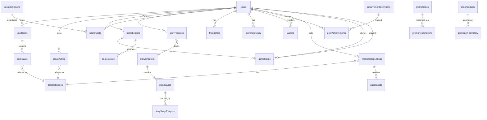

# Database Schema Documentation

## Overview

The LTCG (Lunch Table Card Game) backend uses **Convex** as its real-time database. The schema consists of **40+ tables** organized into logical modules:

- **Authentication & Users**: User accounts, preferences, admin roles
- **Game System**: Lobbies, game states, events, matchmaking
- **Card System**: Card definitions, player collections, decks
- **Economy**: Currency, shop, marketplace, promo codes
- **Progression**: Story mode, quests, achievements, XP
- **Social**: Friends, chat, leaderboards, presence

## Entity Relationship Diagram



## Core Tables

### users

**Purpose**: Central user table with authentication, stats, and economy data.

**Indexes**:
- `email`: Look up users by email (authentication)
- `username`: Look up users by username (profiles, social)
- `rankedElo`: Leaderboard ranking for ranked mode
- `casualRating`: Leaderboard ranking for casual mode
- `totalWins`: Win count leaderboard
- `xp`: XP/level leaderboard

**Key Fields**:

<TypeTable
  type={{
    email: { type: 'string?', description: 'User email (optional for anonymous)' },
    username: { type: 'string?', description: 'Display username' },
    activeDeckId: { type: 'Id<userDecks>?', description: 'Currently selected deck' },
    rankedElo: { type: 'number', default: '1000', description: 'Ranked mode rating' },
    casualRating: { type: 'number', default: '1000', description: 'Casual mode rating' },
    totalWins: { type: 'number', default: '0', description: 'All-time wins' },
    totalLosses: { type: 'number', default: '0', description: 'All-time losses' },
    currentWinStreak: { type: 'number', default: '0', description: 'Active win streak' },
    longestWinStreak: { type: 'number', default: '0', description: 'Best win streak' }
  }}
/>

### cardDefinitions

**Purpose**: Master list of all cards in the game with stats and abilities.

**Indexes**:
- `name`: Look up cards by name
- `element`: Filter by element type
- `rarity`: Filter by rarity
- `cardType`: Filter by card type (creature, spell, etc.)

**Key Fields**:

<TypeTable
  type={{
    name: { type: 'string', description: 'Card name' },
    element: { type: 'string', description: 'Fire, Water, Earth, Wind, or Neutral' },
    rarity: { type: 'string', description: 'common, uncommon, rare, epic, legendary' },
    cardType: { type: 'string', description: 'creature, spell, artifact, or land' },
    cost: { type: 'number', description: 'Mana cost to play' },
    attack: { type: 'number?', description: 'Attack power (creatures only)' },
    health: { type: 'number?', description: 'Health points (creatures only)' },
    abilities: { type: 'object[]', description: 'Array of ability objects' },
    imageUrl: { type: 'string', description: 'Card artwork URL' }
  }}
/>

For complete schema reference including all 40+ tables, see the [full schema documentation](https://github.com/your-org/ltcg/blob/main/convex/schema.ts).

## Query Performance

### Index Usage

All performance-critical queries use dedicated indexes:

```typescript
// ✅ FAST: Uses email index
const user = await ctx.db
  .query('users')
  .withIndex('email', q => q.eq('email', 'user@example.com'))
  .unique();

// ❌ SLOW: Full table scan
const user = await ctx.db
  .query('users')
  .filter(q => q.eq(q.field('email'), 'user@example.com'))
  .unique();
```

### Common Query Patterns

<Accordions>
<Accordion title="Get user with decks">

```typescript
const user = await ctx.db.get(userId);
const decks = await ctx.db
  .query('userDecks')
  .withIndex('userId', q => q.eq('userId', userId))
  .collect();
```

</Accordion>

<Accordion title="Get active game state">

```typescript
const game = await ctx.db
  .query('gameStates')
  .withIndex('lobbyId', q => q.eq('lobbyId', lobbyId))
  .order('desc')
  .first();
```

</Accordion>

<Accordion title="Leaderboard query">

```typescript
const topPlayers = await ctx.db
  .query('users')
  .withIndex('rankedElo')
  .order('desc')
  .take(100);
```

</Accordion>
</Accordions>

## Related Documentation

- [API Reference](/reference/api/core) - Query and mutation functions
- [Backend Architecture](/develop/backend/overview) - System design
- [Performance Guide](/guides/performance/query-optimization) - Optimization tips
